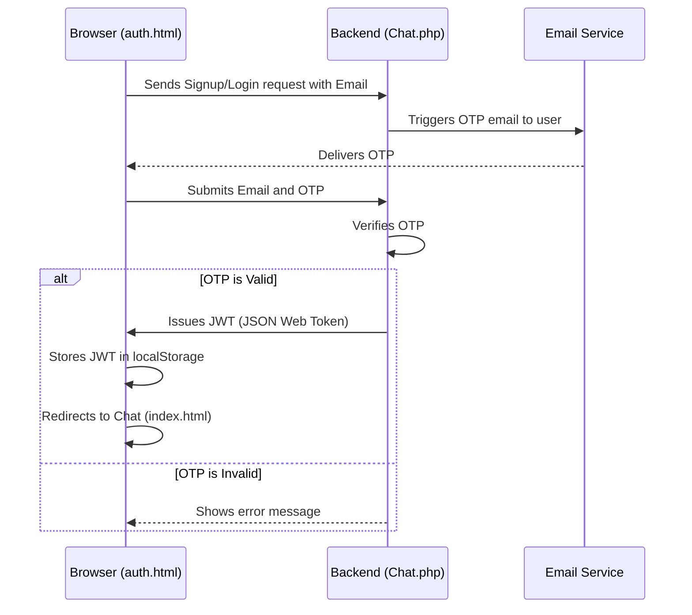
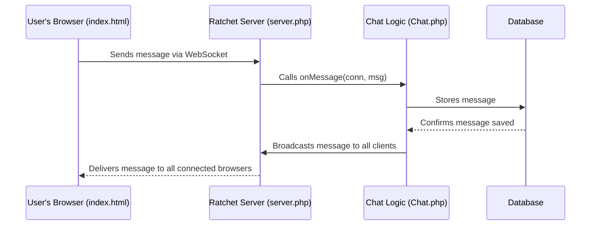

<p align="center">
  
  
  
</p>


# Professional Real-Time Chat Logger

This project is a real-time, browser-based chat application with a persistent logging backend. It serves as a demonstration of a modern, robust PHP architecture, refactored from a fragile, low-level implementation to a professional, stable, and scalable solution using industry-standard tools.

The application features a sleek, responsive frontend built with Tailwind CSS and a powerful, asynchronous WebSocket backend powered by the **Ratchet** library.

## Enhanced Security with OTP and JWT

To ensure a secure and authenticated user experience, the application implements a two-step authentication flow using One-Time Passwords (OTPs) and JSON Web Tokens (JWTs).

1.  **Initial Request (Signup/Login):** The user provides their email. The backend generates a unique, short-lived OTP and sends it to the user's email address.
2.  **Verification:** The user enters the OTP they received. The backend verifies that the OTP is correct and has not expired.
3.  **Token Issuance:** Upon successful verification, the server generates a secure JWT. This token is sent to the client and stored in `localStorage`.
4.  **Authenticated Communication:** For all subsequent requests (e.g., sending a message), the client includes the JWT. The server validates the token on every incoming message to ensure the user is authenticated, creating a stateless and secure session.

This process prevents unauthorized access and ensures that only verified users can participate in the chat.

### Authentication Flow Diagram



## 1. The Challenge: From Fragile to Robust

The initial version of this project was built using low-level, synchronous PHP sockets. This approach, while functional for simple cases, suffered from critical stability issues in a real-world scenario:

-   **Server Crashes:** A single client disconnecting unexpectedly could throw an unhandled exception and crash the entire server process, forcing all users to lose connection.
-   **Complexity:** Manually handling the WebSocket protocol (handshakes, data framing) is complex and highly error-prone.
-   **Poor Scalability:** The synchronous, blocking nature of the old server could not efficiently handle multiple concurrent connections.

It became clear that a fundamental architectural change was needed to build a reliable application.

## 2. The Solution: A Modern, Asynchronous Architecture

To solve these problems, the application was refactored to use a modern, event-driven architecture centered around two key technologies in the PHP ecosystem:

### Composer: Professional Dependency Management

-   **What is it?** [**Composer**](https://getcomposer.org/) is the de-facto standard dependency manager for PHP. It allows us to declare the libraries our project depends on and manages installing and autoloading them.
-   **How we used it:** We created a `composer.json` file in the project root to declare our dependency on Ratchet.

    ```json
    {
        "name": "hakeem/chatlogger",
        "description": "A professional real-time chat logger application, refactored with Ratchet.",
        "type": "project",
        "require": {
            "cboden/ratchet": "^0.4.4"
        },
        "autoload": {
            "psr-4": {
                "ChatApp\\": "src/"
            }
        }
    }
    ```
    Running `composer install` reads this file, downloads Ratchet into the `vendor/` directory, and, most importantly, generates a `vendor/autoload.php` file. This file provides **PSR-4 autoloading**, which automatically loads our application classes as they are needed, eliminating the need for manual `require` statements.

### Ratchet: True WebSockets for PHP

-   **What is it?** [**Ratchet**](http://socketo.me/) is the most popular WebSocket library for PHP. It is built on the powerful **ReactPHP** library, which provides a true, non-blocking, asynchronous event loop (similar to Node.js).
-   **How we used it:** Ratchet allows us to stop worrying about the low-level complexity of the WebSocket protocol and focus purely on our application's logic. It provides a simple, event-driven interface that we implement in our core application class.

## 3. Architecture Deep Dive

The refactoring introduced a clean, standard project structure that separates concerns.

```
/chatlogger/
├── bin/
│   └── server.php      # The server runner script (The "Engine")
├── src/
│   └── Chat.php        # The core application logic (The "Brain")
├── vendor/
│   └── ... (Ratchet and its dependencies)
├── composer.json       # Dependency definition file
├── index.html          # The frontend user interface
└── ...
```

### The Brain: `app/src/Chat.php`

This class is the heart of our application. It implements Ratchet's `MessageComponentInterface`, which is a contract that guarantees our class will respond to the core WebSocket events.

```php
// src/Chat.php
<?php

namespace ChatApp;

use Ratchet\MessageComponentInterface;
use Ratchet\ConnectionInterface;

class Chat implements MessageComponentInterface {
    protected $clients;

    public function __construct() {
        $this->clients = new \SplObjectStorage;
        echo "Chat server started...\n";
    }

    // Called when a new user connects
    public function onOpen(ConnectionInterface $conn) {
        $this->clients->attach($conn);
    }

    // Called when a message is received from a user
    public function onMessage(ConnectionInterface $from, $msg) {
        // ... (logic to save message to DB) ...

        // Broadcast the message to every connected user
        foreach ($this->clients as $client) {
            $client->send($msg);
        }
    }

    // Called when a user disconnects
    public function onClose(ConnectionInterface $conn) {
        $this->clients->detach($conn);
    }

    // Called on error
    public function onError(ConnectionInterface $conn, \Exception $e) {
        $conn->close();
    }
}
```

### The Engine: `app/bin/server.php`

This is the simple entry point script that we execute from the command line. Its job is to configure and run the server. It wires together the components provided by Ratchet and tells it to use our `Chat` class to handle the logic.

```php
// bin/server.php
<?php

use Ratchet\Server\IoServer;
use Ratchet\Http\HttpServer;
use Ratchet\WebSocket\WsServer;
use ChatApp\Chat;

// This one line enables Composer's autoloading magic
require dirname(__DIR__) . '/vendor/autoload.php';

// Assemble and run the server
$server = IoServer::factory(
    new HttpServer(
        new WsServer(
            new Chat() // Tell the server to use our app logic
        )
    ),
    8081 // Run on port 8081
);

$server->run();
```

## 4. How It Works: Message Flow Visualization

The following diagram illustrates how a message travels from a user's browser to the backend and is broadcast out to all other users.



## 5. Setup and Usage

Follow these steps to run the application locally.

### Prerequisites

1.  **PHP**: Ensure you have PHP installed.
2.  **Composer**: [Install Composer](https://getcomposer.org/download/) globally or locally.
3.  **PHP `pdo_mysql` Extension**: The application uses PDO to connect to a MySQL database. Make sure this extension is enabled in your `php.ini` file.
    ```ini
    extension=pdo_mysql
    ```

### Installation

1.  **Clone the repository (if applicable)**

2.  **Install Dependencies:** Open a terminal in the project root and run:
    ```bash
    # If composer is installed globally
    composer install

    # Or if you have composer.phar locally
    php composer.phar install
    ```

3.  **Set up the Database:**
    *   Make sure you have a MySQL server running.
    *   Edit the connection details in `database.php` if they differ from the defaults.
    *   Run the setup script from the terminal:
        ```bash
        php setup_database.php
        ```

### Running the Application

1.  **Start the Chat Server:** Open a terminal, navigate to the project root, and run:
    ```bash
    php bin/server.php
    ```
    This terminal window must remain open, as it is the running server process.

2.  **Use the Chat:** Open the `index.html` file in your web browser. You can open it in multiple tabs or browsers to simulate multiple users.