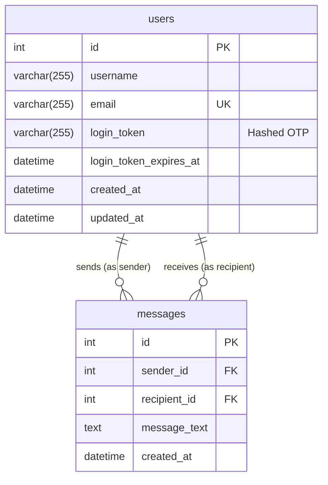

# Refactoring Plan: User Authentication & Direct Messaging

This document outlines the plan to implement a secure, token-based user authentication system (signup and login) and enable direct messaging between authenticated users.

## 1. The Goal: Secure, Session-Based Chat

Our current application treats all users as anonymous broadcasters. To build a true chat application, we need to solve two problems:

1.  **Identity:** We need a secure way for users to create an account and log in, ensuring only they can send messages as themselves.
2.  **Targeted Messaging:** We need to move from a "broadcast-to-all" model to a "direct message" model where a user can send a message to a specific recipient.

This plan addresses both by introducing a passwordless, email-based authentication flow and refactoring the WebSocket communication protocol.

## 2. Core Concepts & Architecture

### A. Passwordless Token-Based Authentication with Email OTP

Instead of traditional passwords, we will implement a more modern and secure "passwordless" login flow using One-Time Passwords (OTPs) sent via email.

**The Flow:**

1.  **Signup/Login Request:** A user enters their email address on the frontend.
2.  **OTP Generation:** The server generates a secure, single-use OTP token (e.g., a 6-digit number or a short UUID). This token is associated with the user's email, hashed, and stored in the database with a short expiration time (e.g., 15 minutes).
3.  **OTP Delivery via Email:** The server uses a dedicated email service to send the OTP directly to the user's email address. This is a critical security step, as it verifies that the user owns the email account.
4.  **Verification:** The user retrieves the OTP from their email and submits it on the frontend. The server hashes the provided OTP and compares it to the stored hash in the database.
5.  **Session Token (JWT):** If the OTP is valid, the server generates a long-lived **JSON Web Token (JWT)**. This JWT is sent to the client. The single-use OTP is then deleted or invalidated from the database to prevent reuse.
6.  **Authenticated Actions:** For all subsequent actions (like sending a message), the client must include the JWT in its request. The server validates the JWT to confirm the user's identity.

### B. JSON Web Tokens (JWT) for Session Management

JWTs are the industry standard for creating secure, stateless session tokens. They allow our server to verify a user's identity on every request without needing to look up session data in a database, which is perfect for a high-performance chat application.

## 3. Database Schema Design

The database schema remains the same as the previous plan, designed to support the authentication flow and direct messaging.

### Mermaid Diagram



## 4. New Project Structure

To accommodate the email service, we will add a new `EmailService` class.

```
/chatlogger/
├── bin/
│   └── server.php
├── src/
│   ├── Auth/
│   │   └── AuthService.php      # Handles auth logic (tokens, JWTs)
│   ├── Email/
│   │   └── EmailService.php     # NEW: Handles sending OTP emails
│   └── Chat.php                 # MODIFIED: To handle authenticated messaging
├── vendor/
│   └── ...
├── .env                         # NEW: For storing credentials
├── .env.example                 # NEW: Example for .env
├── .gitignore
├── composer.json
├── config.php                   # MODIFIED: Stores JWT secret and email credentials
├── database.php
├── index.html                   # MODIFIED: For login UI and authenticated calls
└── ... (other files)
```

## 5. Required Libraries

We will add three professional-grade libraries to our project.

1.  **`firebase/php-jwt`**: For creating and validating JSON Web Tokens.
    *   **Link:** [https://github.com/firebase/php-jwt](https://github.com/firebase/php-jwt)
2.  **`ramsey/uuid`**: For generating secure, random tokens for our OTPs.
    *   **Link:** [https://github.com/ramsey/uuid](https://github.com/ramsey/uuid)
3.  **`phpmailer/phpmailer`**: The world's most popular library for sending email from PHP.
    *   **Link:** [https://github.com/PHPMailer/PHPMailer](https://github.com/PHPMailer/PHPMailer)
4.  **`vlucas/phpdotenv`**: For loading environment variables from a `.env` file.
    *   **Link:** [https://github.com/vlucas/phpdotenv](https://github.com/vlucas/phpdotenv)

### Updated `composer.json`

```json
{
    "name": "hakeem/chatlogger",
    "description": "A professional real-time chat logger application, refactored with Ratchet.",
    "type": "project",
    "require": {
        "cboden/ratchet": "^0.4.4",
        "firebase/php-jwt": "^6.3",
        "ramsey/uuid": "^4.2",
        "phpmailer/phpmailer": "^6.5",
        "vlucas/phpdotenv": "^5.4"
    },
    "autoload": {
        "psr-4": {
            "ChatApp\\": "src/"
        }
    }
}
```

## 6. Step-by-Step Implementation Plan

**Step 1: Environment Setup**
1.  Create a `.env.example` file to serve as a template.
2.  Create a `.env` file (a copy of the example) and fill in your actual credentials.
3.  Add `.env` to your `.gitignore` file immediately.

**`.env.example` file:**
```
# JWT Secret Key - generate a long, random string
JWT_SECRET=

# Gmail SMTP Configuration
SMTP_HOST=smtp.gmail.com
SMTP_PORT=587
SMTP_USER=your-email@gmail.com
SMTP_PASSWORD=your-google-app-password

# Email From Address
SMTP_FROM_EMAIL=your-email@gmail.com
SMTP_FROM_NAME=ChatApp
```

**CRITICAL SECURITY NOTICE: Using Gmail SMTP**

To use Gmail's SMTP server, you **MUST** enable 2-Factor Authentication (2FA) for your Google account and then generate a **16-character App Password**.

-   **DO NOT** use your regular Google account password in the `.env` file. It will not work and is a major security risk.
-   **How to get an App Password:**
    1.  Go to your Google Account settings.
    2.  Navigate to "Security".
    3.  Under "Signing in to Google," click on "2-Step Verification" and enable it if you haven't already.
    4.  Go back to the Security page and click on "App passwords".
    5.  Generate a new password for "Mail" on "Other (Custom name)" (you can name it "ChatApp").
    6.  Google will give you a 16-character password. Copy this password and paste it as the value for `SMTP_PASSWORD` in your `.env` file.

**Step 2: Update Dependencies**
1.  Modify `composer.json` to include the new `phpmailer/phpmailer` and `vlucas/phpdotenv` packages.
2.  Run `composer update` to install the new dependencies.

**Step 3: Load Environment Variables**
Modify `config.php` to load the variables from your `.env` file.

```php
// config.php
<?php
require_once __DIR__ . '/vendor/autoload.php';

$dotenv = Dotenv\Dotenv::createImmutable(__DIR__);
$dotenv->load();

// You can now access your variables using $_ENV or getenv()
// e.g., $jwtSecret = $_ENV['JWT_SECRET'];
```

**Step 4: Database Migration**
1.  Execute the SQL provided in Section 3 to update the database schema if you haven't already.

**Step 5: Create `EmailService.php`**
1.  This new class will be responsible for configuring PHPMailer and sending emails using the credentials from the `.env` file.
2.  It will have one primary method: `sendOtpEmail(string $toEmail, string $otp, bool $isNewUser)`.
3.  This method will construct a beautiful HTML email.
    *   If `isNewUser` is true, the subject will be "Welcome to ChatApp! Your Login Code". The body will contain a welcome message.
    *   If `isNewUser` is false, the subject will be "Your ChatApp Login Code".
    *   The email body will clearly display the OTP and mention its expiration time.
    *   **Crucially, it will include a warning:** "You are receiving this email because of a login attempt on our development server. Since we are not using HTTPS yet, please be cautious. If you did not request this code, you can safely ignore it. **Please check your spam/junk folder if you don't see our emails.**"

**Step 6: Update `AuthService.php`**
1.  The `generateLoginToken` method will be modified.
2.  After generating and storing the hashed OTP, it will instantiate the `EmailService` and call the `sendOtpEmail` method.
3.  It will no longer return the plain OTP to the `Chat` class. Its job is now to trigger the email delivery.

**Step 7: Refactor `Chat.php`**
1.  The `onMessage` router will be updated.
2.  The `type: 'request_login'` message will now only contain the user's email. It will trigger the `AuthService` to generate and send the OTP email.
3.  The client will then send a `type: 'verify_login'` message containing the email and the OTP received from the email.

**Step 8: Update Frontend (`index.html`)**
1.  The UI flow will be adjusted:
    *   **Initial State:** A form asks for the user's email.
    *   **OTP State:** After submitting the email, the UI will display a message: "We've sent a login code to your email. Please check your inbox (and spam folder) and enter the code below." It will then show a form to enter the OTP.
    *   **Chat State:** After successful OTP verification, the main chat interface is shown.

## 7. Security & Production Readiness

-   **Email Credentials:** The provided SMTP credentials are sensitive. The use of `.env` and `.gitignore` is essential.
-   **Deliverability:** For production, using a transactional email service like **SendGrid**, **Mailgun**, or **Amazon SES** is strongly recommended over a standard SMTP server (like Gmail). These services provide much higher deliverability rates and are designed for application emails.
-   **HTTPS/WSS:** As stated before, for a production environment, the entire application **MUST** be served over HTTPS, and the WebSocket connection must use the secure `wss://` protocol to protect JWTs and other data in transit.

This updated plan provides a more secure and realistic implementation that mirrors professional application development practices.
